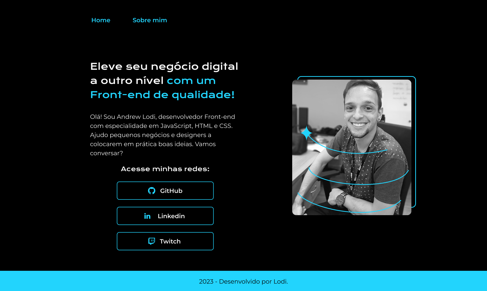

  
  

  
## 💻 Projeto
Esse é um projeto Web Responsivo de um portfólio para divulgação do meu trabalho, disponibilizando minhas redes sociais para contato profissional.

## ⚙ Tecnologias
Esse projeto foi desenvolvido com os cursos do Alura sobre as seguintes tecnologias:

- HTML
- CSS

## 🏷 Layout
Você pode visualizar o layout do projeto Web e Mobile através 
[desse link](https://www.figma.com/file/fF3yzsQfeUNl62xT6GDhuZ/Portfolio-Web%2FMobile---Alura?type=design&node-id=0-1&t=ftM7zGotBGRIVok2-0).
É necessário ter uma conta no [Figma](https://www.figma.com).
